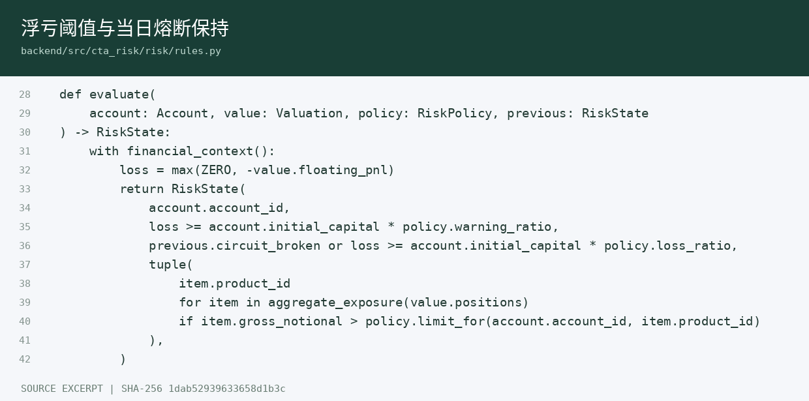
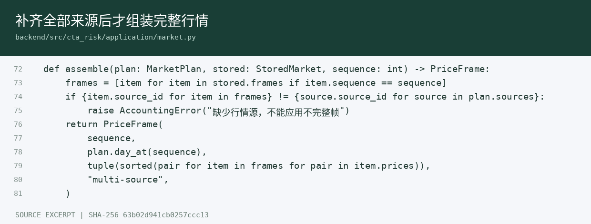
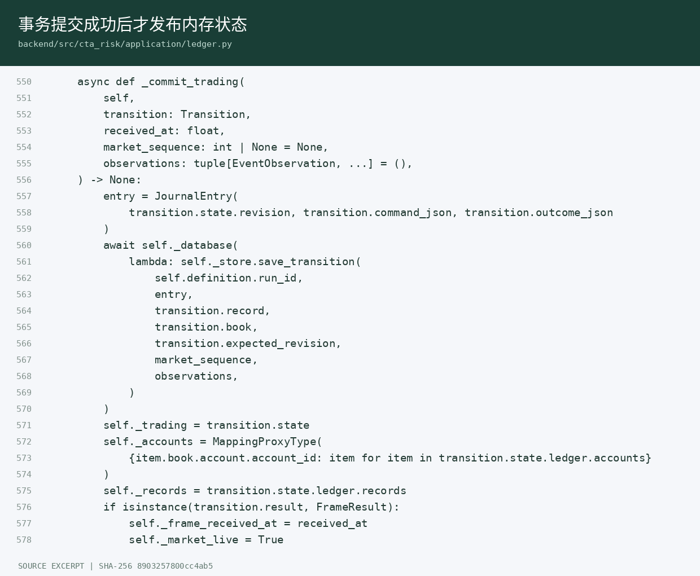
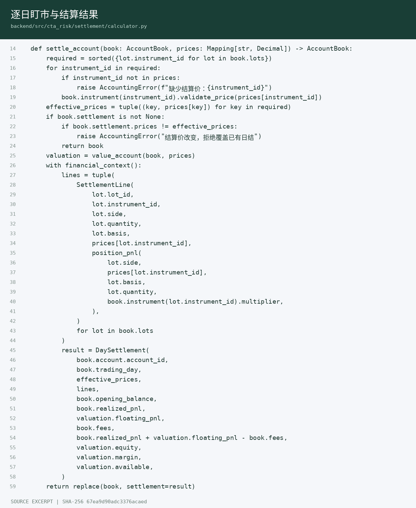

# 代码展示

更新日期：2026-09-12。以下四张图片直接摘取本仓库源文件并渲染，保留路径、原始行号和源文件 SHA-256。它们用于讲解关键实现，不是编辑器界面截图；完整源码随交付包提供。行号及完整摘要见 [sources.json](assets/code/sources.json)。

## 浮亏与熔断

[`risk/rules.py`](../backend/src/cta_risk/risk/rules.py) 中 `evaluate` 比较持仓浮亏与初始资金阈值，用前态保持当日熔断，并独立判断品种总敞口。

## 完整行情

[`application/market.py`](../backend/src/cta_risk/application/market.py) 中 `assemble` 要求同序号数据覆盖全部来源；缺少来源时不能生成用于风控的完整报价。来源内顺序、价格与摘要校验在此前处理。

## 提交顺序

[`application/ledger.py`](../backend/src/cta_risk/application/ledger.py) 中 `_commit_trading` 先提交持久化事务，成功后更新只读内存状态；页面和查询接口不会提前看到未提交的成交或风险结果。

## 逐日盯市

[`settlement/calculator.py`](../backend/src/cta_risk/settlement/calculator.py) 中 `settle_account` 检查结算价，按持仓批次生成盯市明细，记录当日盈亏、余额、保证金与可用资金；相同结算价重复调用返回已有日结。

